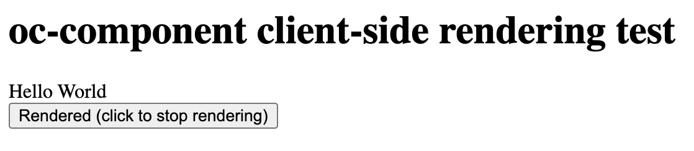

# OpenComponents rendering test

The purpose of this app is to test whether `<oc-component>` can be dynamically rendered.

This is a Next.js app, so server-side and client-side rendering are supported.

To test client-side rendering, navigate to `/oc-test` by clicking the link on the home page.

To test server-side rendering, refresh the `/oc-test` page.

Client-side rendering can also be tested by pressing the button to toggle rendering the `<oc-component>` element.

## Getting started

Install dependencies

```sh
npm i
```

Run the app

```sh
npm run dev
```

Download and run the [oc-components](https://github.com/opencomponents/oc-components-examples) local registry. Verify that it's running by navigating to http://localhost:3030.

Open http://localhost:3000 in your browser.

## Results

When the component is rendered, the page looks like this:



When it's not rendered, "Hello World" isn't shown.

### Expected result

When toggling the render button off and then back on, "Hello World" should reappear.

### Actual result

"Hello World" isn't rendered again.
